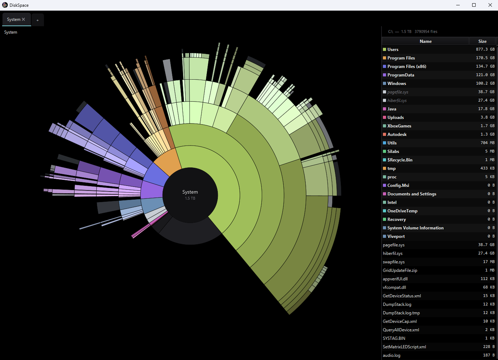

# DiskSpace

[](https://github.com/thegreystone/diskspace/actions/workflows/build.yml)
[](https://github.com/thegreystone/diskspace/releases/latest)
[](https://adoptium.net/)
[](https://openjfx.io/)
[](https://www.graalvm.org/)
[](https://opensource.org/licenses/BSD-3-Clause)

A cross-platform disk space visualizer that shows where your space went, with two complementary views: a **sunburst**
(hierarchical radial layout, good for spotting depth-imbalanced subtrees and proportional weight at a glance) and a
**squarified-treemap heatmap** (good for finding the largest individual cells across the whole tree). Press `V` to
toggle.



## Quick Start

### Option A: Native Binary (recommended)

Download the binary for your platform from
the [Releases page](https://github.com/thegreystone/diskspace/releases/latest):

| Platform                                | File                                           |
|-----------------------------------------|------------------------------------------------|
| Linux x86_64                            | `diskspace-<version>-linux-x86_64`             |
| macOS Apple Silicon                     | `diskspace-<version>-macos-aarch64.dmg`        |
| Windows x86_64 (installer, recommended) | `diskspace-<version>-windows-x86_64-setup.exe` |
| Windows x86_64 (standalone)             | `diskspace-<version>-windows-x86_64.exe`       |

The Windows installer registers DiskSpace under Programs & Features, creates a Start Menu entry, and offers an optional
desktop shortcut. The standalone `.exe` is a single-file binary you can drop anywhere and run — no install, no registry,
nothing to uninstall. Both are produced from the same GraalVM-native binary; the installer is just smaller on disk
thanks to LZMA2 compression.

On Linux, make the binary executable: `chmod +x diskspace-*-linux-*`.
On macOS, open the `.dmg` and drag DiskSpace into Applications.

#### Windows: getting past Edge / SmartScreen

The Windows installer and standalone `.exe` aren't code-signed yet, so Microsoft Edge / Defender
SmartScreen treat them as "isn't commonly downloaded". On recent Edge versions the warning dialog
only offers *Cancel* and *Delete* — there's no *Keep anyway* button. The download bar's hidden
*Keep anyway* item has also been removed in some Edge releases. You have a few options.

**Download via PowerShell** (bypasses Edge's SmartScreen entirely):

```powershell
$url = "https://github.com/thegreystone/diskspace/releases/latest/download/diskspace-0.2.4-windows-x86_64-setup.exe"
$out = "$env:USERPROFILE\Downloads\diskspace-setup.exe"
Invoke-WebRequest -Uri $url -OutFile $out
Unblock-File $out         # clears the "downloaded from internet" mark so the OS doesn't re-warn
Start-Process $out         # runs the installer (UAC prompt will appear)
```

Substitute the version in the URL for the release you want, or use `curl.exe -L -o $out $url`
if you prefer. Edit `$url` for the standalone `.exe` if you'd rather skip the installer.

**Alternative: download with another browser.** Firefox and Chrome show different warning UX
that still includes a *Keep / Save anyway* path.

**Last resort: temporarily disable SmartScreen for downloads.**
`edge://settings/privacy` → *Security* section → toggle *Microsoft Defender SmartScreen* off,
download, toggle it back on. Heavy-handed but works on locked-down Edge configurations.

After the file is on disk, opening it triggers a separate OS-level *"Windows protected your PC"*
dialog — that one **does** have a *More info → Run anyway* path. Approve the UAC prompt
afterward. *Publisher: Unknown* is expected until we sign the binary.

Want to help the next person? On the SmartScreen dialog there's a *"Report this app as safe"*
link — enough such reports build the file's reputation in SmartScreen and the warnings ease off
on their own. Long-term fix is a code-signing cert; not done yet.

### Option B: Run from source (dev)

Requires Java 21+ and Maven 3.9+:

```bash
mvn javafx:run
```

## Keybindings

| Key       | Action                                                                                             |
|-----------|----------------------------------------------------------------------------------------------------|
| `←` / `↑` | Go up one level. Stops at the scan root.                                                           |
| `→` / `↓` | Go forward. Replay a step you went up from. Stops when there's nothing left.                       |
| `E` / `F` | Open the hovered sector (or the current view) in your system file explorer.                        |
| `Del`     | Stage selected rows (or the current section) for deletion. Press again on a staged row to unstage. |
| `R`       | Re-scan the current disk from scratch.                                                             |
| `S`       | (picker only) Cycle scan strategy: Auto → MFT → Parallel → Sequential.                             |
| `U`       | Toggle size units between decimal (GB, default) and binary (GiB).                                  |
| `V`       | Toggle visualization between sunburst (default) and heatmap (squarified treemap).                  |
| `Esc`     | Show / hide the keyboard-shortcut overlay (renders on top of the live view).                       |
| `Q`       | Quit DiskSpace.                                                                                    |

You can also click any segment of the breadcrumb in the top-left to jump directly to that ancestor, or click the center
hub to reset all the way back to the scan root.

## Building from Source

### Run on the JVM

**Prerequisites:** Java 21+ and Maven 3.9+.

```bash
mvn javafx:run
```

### Native image

**Prerequisites:** [GraalVM 21 LTS](https://www.oracle.com/java/technologies/downloads/#graalvmjava21) with
`native-image`, Maven 3.9+, and the platform toolchain:

- **Windows**: Visual Studio 2022 with the "Desktop development with C++" workload.
- **macOS**: Xcode Command Line Tools.
- **Linux**: `gcc`, plus dev headers for X11/GTK as required by JavaFX.

```bash
mvn -Pnative gluonfx:build gluonfx:nativerun
```

The native binary will be at `target/gluonfx/<arch>-<os>/diskspace[.exe]`.

> Native builds are pinned to GraalVM 21 LTS. GraalVM 25's Substrate VM has a JNI version regression that breaks JavaFX
`glass` at startup; see `DESIGN.md § 7.5` for details. The `gluonfx-maven-plugin` reads `GRAALVM_HOME` (not
`JAVA_HOME`) — `build-native.ps1` overrides both.

## Mac Notes

DiskSpace handles several APFS- and macOS-specific quirks. None of them require user intervention except where noted.

**Scan root is `/System/Volumes/Data`, not `/`.** On modern macOS, `/` is a read-only sealed APFS system snapshot. The
user-mutable filesystem is mounted at `/System/Volumes/Data` and surfaced into `/` via *firmlinks* (`/Users`,
`/Applications`, `/private`, …). Scanning from `/` would cross those firmlinks back into Data and double-count
everything. When you pick "Macintosh HD", DiskSpace silently rewrites the scan root to `/System/Volumes/Data`.

**"OS used / OS free" reflects the Data volume only.** APFS volumes inside one container share a free-space pool, but
each volume has its own block count. DiskSpace queries the `FileStore` at the scan root, so "OS used" matches what
`df /System/Volumes/Data` prints — the bytes a *user* can actually free. The system snapshot, Preboot, VM swap, and
local Time Machine snapshots aren't represented because they aren't user-deletable from a file browser anyway.

**APFS clones can inflate scanned totals.** Per-file sizes come from `st_blocks × 512`. Cloned files (Xcode SDKs,
simulator runtimes, system installers, large copy-on-write `cp -c` artifacts) share extents physically but each clone
reports its full block count. The scanner can therefore report a sum that exceeds the volume's actual used space —
sometimes by 20–30% on a developer machine. Java's NIO doesn't expose extent identity, so portable dedup isn't possible;
clone-aware accounting would require Apple-specific syscalls (`getattrlist` / `fcntl(F_LOG2PHYS_EXT)`). Treat scanned
totals as an upper bound; `df` is the truth for the volume.

**Firmlinks, hard links, and bind-mounts are deduped.** The scanner tracks visited inodes (`fileKey`), so a directory or
file reachable via more than one path is only counted once.

**Cross-volume boundaries aren't crossed.** Subdirectories that live on a different APFS volume — most commonly
iOS/watchOS Simulator data volumes mounted under `Library/Developer/CoreSimulator/Volumes` — are detected by device ID
and skipped, so they don't get folded into the parent volume's totals.

**Full Disk Access is recommended.** Without FDA, several user-visible folders (Mail, Messages, Safari history,
Calendar, Reminders) are unreadable. On first run DiskSpace shows a prompt with a shortcut to the right pane in System
Settings; click "Don't ask again" to suppress. Even with FDA granted, a small residual of inaccessible paths is normal —
sandboxed app containers and per-process `/private/var/folders` directories deny access regardless.

**Volume label resolution via `/Volumes`.** The Finder-visible label of an APFS volume (e.g. "Macintosh HD") doesn't
appear in the path hierarchy under `/`. DiskSpace looks under `/Volumes` for an entry whose inode matches the scan root
and uses that name when found, otherwise falls back to the device node.

**Trash vs permanent delete.** macOS exposes `java.awt.Desktop.MOVE_TO_TRASH`, so the deletion confirmation dialog
reads "Move to Trash" and items can be restored from Finder. The fallback "Delete permanently" path is only used on
platforms that don't expose a trash API.

**The `Hidden → Other` bucket includes purgeable space.** macOS doesn't expose its purgeable-space figure (Time Machine
local snapshots, swap, sleepimage, system caches) through any shell command we can portably call from Java, so we don't
break it out as its own row. It's lumped into `Other` along with filesystem overhead, the Spotlight index, and other
users' home folders. To investigate the contents directly: `tmutil listlocalsnapshots /` lists Time Machine snapshots,
`diskutil apfs listSnapshots /System/Volumes/Data` lists *all* snapshots (including third-party), and Disk Utility's "
First Aid" can flag filesystem errors that inflate this bucket.

## Troubleshooting

- **`mvn javafx:run` complains about missing JavaFX modules**: ensure `JAVA_HOME` points to a JDK 25+, and that Maven is
  using it (`mvn -v`). The plugin downloads JavaFX automatically.
- **Native build fails on Windows**: open a "x64 Native Tools Command Prompt for VS 2022" and run
  `mvn -Pnative gluonfx:build` from there — the C++ toolchain must be on `PATH`.
- **Window appears blank or fails to render**: confirm hardware acceleration / OpenGL drivers are installed. JavaFX
  falls back to software rendering, but it is slow.
