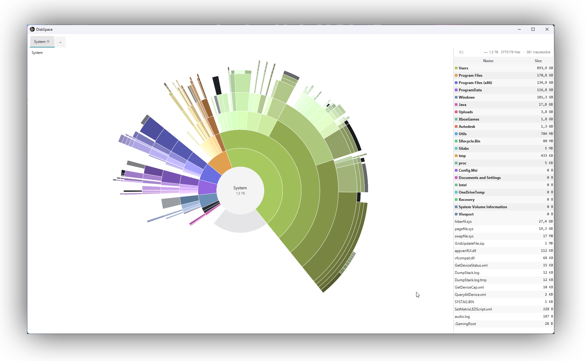

# DiskSpace

A cross-platform disk space visualizer that shows where your space went, with two complementary views: a **sunburst**
(hierarchical radial layout, good for spotting depth-imbalanced subtrees and proportional weight at a glance) and a
**squarified-treemap heatmap** (good for finding the largest individual cells across the whole tree). Press `V` to
toggle.

## Quick Start

Download the binary for your platform from the
[Releases page](https://github.com/thegreystone/diskspace/releases/latest):

| Platform                                | File                                           |
|-----------------------------------------|------------------------------------------------|
| Linux x86_64                            | `diskspace-<version>-linux-x86_64`             |
| macOS Apple Silicon                     | `diskspace-<version>-macos-aarch64.dmg`        |
| Windows x86_64 (installer, recommended) | `diskspace-<version>-windows-x86_64-setup.exe` |
| Windows x86_64 (standalone)             | `diskspace-<version>-windows-x86_64.exe`       |

- **Linux**: `chmod +x diskspace-*-linux-*` then run it.
- **macOS**: open the `.dmg` and drag DiskSpace into Applications.
- **Windows**: the installer registers a Start Menu entry; the standalone `.exe` is a drop-anywhere single file. Both
  produce the same GraalVM-native binary. Microsoft Edge SmartScreen may need a nudge — see
  [docs/DOCUMENTATION.md](docs/DOCUMENTATION.md#installing-on-windows-getting-past-edge--smartscreen).

Building from source and contributing: see [docs/DEVGUIDE.md](docs/DEVGUIDE.md).

## Keybindings

| Key       | Action                                                                                             |
|-----------|----------------------------------------------------------------------------------------------------|
| `←` / `↑` | Go up one level. Stops at the scan root.                                                           |
| `→` / `↓` | Go forward. Replay a step you went up from. Stops when there's nothing left.                       |
| `E` / `F` | Open the hovered sector (or the current view) in your system file explorer.                        |
| `Del`     | Stage selected rows (or the current section) for deletion. Press again on a staged row to unstage. |
| `R`       | Re-scan the current disk from scratch.                                                             |
| `S`       | (picker only) Cycle scan strategy: Auto → MFT → Parallel → Sequential.                             |
| `U`       | Toggle size units between decimal (GB, default) and binary (GiB).                                  |
| `V`       | Toggle visualization between sunburst (default) and heatmap (squarified treemap).                  |
| `C`       | Cycle coloring mode (Classic, Black & White, …).                                                   |
| `Esc`     | Show / hide the keyboard-shortcut overlay (renders on top of the live view).                       |
| `Q`       | Quit DiskSpace.                                                                                    |

Click any segment of the breadcrumb to jump to that ancestor, or the center hub to reset to the scan root. Click the
path label above the file table to copy the current view's full path to the clipboard. Right-click for the context
menu (including **Preferences…**).

## Documentation

- **[docs/DOCUMENTATION.md](docs/DOCUMENTATION.md)** — end-user reference: Windows SmartScreen workaround, the
  persistent Preferences system, the built-in coloring modes, macOS-specific notes, and end-user troubleshooting.
- **[docs/DEVGUIDE.md](docs/DEVGUIDE.md)** — for contributors: building from source (JVM + native), adding a new
  coloring mode, profiling with JFR + JMC, and dev-side troubleshooting.
